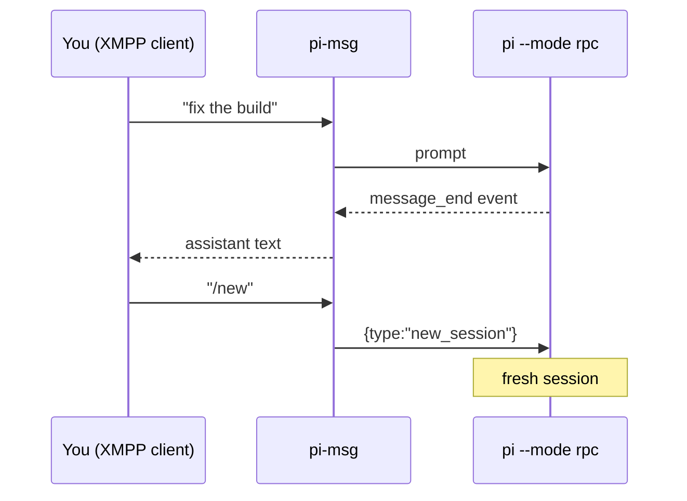

# pi-msg

Drive the [Pi](https://pi.dev) coding agent **entirely from an XMPP chat client** —
1:1 or in a group chat (MUC).

`pi-msg` launches `pi --mode rpc`, then bridges Pi's JSONL event stream to XMPP
(via [mellium.im/xmpp](https://mellium.im/xmpp)): the assistant's replies are relayed
to you as chat messages, and your chat messages drive the agent — plain prompts **and**
slash commands, exactly as if you'd typed them into Pi locally.

Because it runs Pi in RPC mode, commands like `/new` work over chat (an earlier
in-process-extension version couldn't do this — `sendUserMessage` can't invoke Pi's
command layer).

## How it works

Conversations are persisted across restarts: pi-msg records the pi session file
(`<config-dir>/<account>.session`) on startup, whenever the session changes
(`/new`, `/resume`, `/fork`), and on shutdown — then resumes it on the next
launch via `pi --session <file>`. A bridge restart therefore **continues the
previous conversation**; only `/new` resets context (or an explicit
`--prompt` on-demand spawn — see below). If the saved session file
is missing or empty, pi-msg starts a fresh session instead.



- Each finished **assistant message** → sent to you as chat.
- Agent state shows on three independent signals (1:1): a **typing indicator** while a
  reply is actually being written, presence **`<show>`** (`dnd` while busy, available
  when idle), and a presence **status** label of the current activity (`thinking…`,
  `running: <cmd>`, `replying…`, `retrying…`, `listening`). When a run settles
  without delivering anything you get a `✅ done (no reply) — your turn` nudge.
  A reply that was written but could not be routed does **not** count as
  delivered, so a dropped reply still raises the nudge instead of passing as an
  answer.
- **Empty-tail recovery**: when a run ends on a tool call with no reply text
  after it, the answer was never written and nothing can be sent. The bridge
  asks the agent once per turn to write the reply, then falls back to the
  `done (no reply)` nudge if that also produces nothing.
- **Unanswered-message hint**: a message that arrives mid-run is injected as a
  steer at the next yield point, usually the moment a tool result returns. The
  agent can read the new question before it writes the answer to the previous
  one, and then never write it. When a run takes in more messages than it sends
  replies, the bridge asks it once per turn to check for messages that still
  need an answer. The hint carries the run's chat history — every message in and
  every reply out, in order, each with its stanza id — because the agent cannot
  see the XMPP traffic and the bare counts leave it guessing which message it
  missed. The hint asks for `to: <jid|stanza-id>`: an id both routes the reply
  and marks it as a reply to the message it answers. The agent answers them all
  in that one turn, with several `to:` lines, or replies `to: noop` if it already
  covered everything. Each `to:` segment counts as one answer, so a single reply
  that fans out to three people is not mistaken for one unanswered message. The run that answers a hint is
  never hinted about in turn. `to: noop` counts as an answer, so deliberate
  silence is never flagged.
- Messages you send are acknowledged with a single **read receipt** — a XEP-0333
  chat marker (`displayed`) — when the agent takes them in, if your client requests it.
- Your chat messages → routed to Pi:

| You send | Becomes |
| --- | --- |
| plain text | a prompt to the agent |
| `/skill:name …`, `/template …`, any extension command | a prompt (Pi expands/runs it) |
| `/new` | `new_session` (fresh session; connection stays up) |
| `/compact [instructions]` | `compact` |
| `/model <provider/id>` or `/model <search>` | `set_model` |
| `/models` | list available models with the current one marked (no LLM turn) |
| `/session` | session stats — id, file, message counts, tokens, cost (no LLM turn) |
| `/name [name]` | show the session display name, or set it |
| `/think <off\|low\|medium\|high\|…>` | `set_thinking_level` |
| `/abort` (or `/stop`) | `clear_queue`, then `abort` — stops the run AND flushes pi's queued messages: a steer that landed mid-run can't start a fresh run the instant the aborted one stops. The reply names how many queued messages it dropped. |
| `!` | `abort` only — the quick interrupt. Stops whatever is currently running (a command or thinking) but leaves queued messages intact, so the next one is evaluated right after. |
| `/dump` (or `/dump pretty`) | send the session transcript to the owner — raw JSONL, or `pretty` for indented per-record JSON (no LLM turn) |
| `/export` | render the current session to HTML via pi's `export_html` RPC and **send it as a file over XMPP** (XEP-0363 HTTP Upload) — **deterministic**, no agent turn; the rendered session lands as an inline, downloadable file |
| `/quit` (or `/exit`) | shut down the bridge and Pi |

Every bridged command also works with a `!` prefix — `/new` and `!new` are
interchangeable. A lone `!` (no command name after it) is the quick
interrupt: it aborts the current run like `/abort`, but WITHOUT the queue
flush — whatever you queued behind the running message is still evaluated
next. The prefix only matters for the owner: non-owners' messages
are always treated as literal text.

### Connection robustness

A wedged connection must surface as an error the bridge can act on, not as
silence. Two failure modes are handled explicitly:

- **A peer that stops acknowledging our data** (it keeps sending us stanzas, so
  the socket looks alive and reads keep working). The dialer sets
  `TCP_USER_TIMEOUT` (45 s on Linux), so a write fails with `ETIMEDOUT` in under
  a minute instead of waiting out the kernel's retransmission budget — which is
  minutes, and long enough for the bridge to look online-but-mute. A short TCP
  keepalive (30 s idle, 3 probes) declares a black-holed path dead in both
  directions within about a minute.
- **A close that does not actually reconnect.** The keepalive (XEP-0199)
  detects a dead connection and forces a close, which now *always* severs the
  transport — `session.Close()` alone is XMPP-level bookkeeping and can return
  while the read loop is still running. Severing the transport is what makes
  the read loop unwind so `Run()` re-dials, and each further failing keepalive
  tick forces another close until the connection is replaced, rather than the
  recovery being a single attempt.

## Configuration

Create `~/.config/pi-msg/config.json` (override the path with `PI_MSG_CONFIG`), then
`chmod 600` it:

```json
{
  "accounts": {
    "default": {
      "jid": "pi@chat.example.com",
      "password": "super-secret",
      "owner": "you@chat.example.com",
      "model": "anthropic/claude-sonnet-latest",
      "workdir": "/path/to/your/project"
    }
  }
}
```

Per-account fields:

| field | required | default | notes |
| --- | --- | --- | --- |
| `jid` | yes | — | bare JID of the bot account |
| `password` | yes | — | bot account password |
| `owner` | yes | — | the human this account relays to; the **canonical** (trusted) driver |
| `service` | no | `<jid-domain>:5222` | `host:port` (a leading `xmpp://` is tolerated) |
| `resource` | no | `pi-msg` | XMPP resource (client-session label) |
| `model` | no | Pi's default | model pattern passed to `pi --model` |
| `workdir` | no | current dir | working directory for the agent (also where Pi discovers `AGENTS.md`/`CLAUDE.md`) |
| `room` | no | — | a bare MUC JID (or an **array** of them) to also join for **group chat** (see below) |
| `nick` | no | JID localpart | occupant nickname used in the room(s) |
| `roomTrigger` | no | `nick` | address prefix that makes a room message a prompt (e.g. `pi` → `pi: …`) |
| `uploadService` | no | auto-probed | XEP-0363 upload component JID for file transfer (e.g. `upload.chat.example.com`) |
| `errorRoom` | no | — | write-only MUC dumping ground for dropped/unrouteable agent replies (see below) |
| `pingInterval` | no | `60s` | keepalive cadence (Go duration): XEP-0199 server ping + XEP-0410 MUC self-ping; `0` disables |
| `reactions` | no | `false` | XEP-0444 emoji reactions on 1:1 owner messages: lifecycle → 👀 picked up / ✅ done / ⛔ aborted, and enables the agent-driven `send_reaction` tool (see [Agent tools](#agent-tools)) |
| `beforeAgentStartText` | no | — | literal text injected into the agent's system prompt on **every turn** (the companion extension's `before_agent_start`), after the identity line. Re-applied each turn, so a steer holds up in a long session instead of fading — the same property the equivalent Claude Code `UserPromptSubmit` hook relies on. Empty (or whitespace) means no injection; see [Per-turn prompt text](#per-turn-prompt-text-beforeagentstarttext) |
| `avatar` | no | — | path to a local image (PNG/JPEG/GIF) published as the bot's XEP-0153 vCard profile picture on connect |
| `creditWatch` | no | — | low-credit protection with a `minBelowUsd` floor. Reports the remaining OpenRouter balance after every `/new`, and a proactive watcher probes the balance hourly and DMs the owner when it drops below the floor (re-warns at most every 6h while still below). A model run that dies on an OpenRouter out-of-credits error (HTTP 402) is also reported to the owner directly instead of the generic "done (no reply)". e.g. `{ "creditWatch": { "minBelowUsd": 2 } }`. Only active when pi's auth file (`<config-dir>/auth.json`) holds an `openrouter` api key; otherwise it's skipped |
| `mam` | no | `true` | XEP-0313 archive backfill on startup; set `false` to opt out — see [Archive backfill](#archive-backfill-mam) |

Multiple accounts: add more keys under `accounts`; `default` is used unless you set
`PI_MSG_ACCOUNT=<name>`. In 1:1 mode only the `owner` JID may drive the agent.

## Per-turn prompt text (`beforeAgentStartText`)

`beforeAgentStartText` is injected into the agent's system prompt at the start
of **every turn**, after the identity line. Re-applying it each turn is the
point: a one-off instruction fades over a long session, a per-turn one does not.
This is pi-msg's equivalent of a Claude Code `UserPromptSubmit` hook — the same
mechanism, minus the shell command (a `beforeAgentStartHook` variant is planned,
not built).

A terse-replies setup (the same instruction as the Claude `terse-reminder.sh`
hook):

```json
{
  "accounts": {
    "bot": {
      "jid": "bot@chat.example.com",
      "password": "…",
      "owner": "zach@chat.example.com",
      "beforeAgentStartText": "terse mode: <=8 lines, outcome first, no narration/boilerplate, ASD-STE100 Simplified Technical English. Short sentences, active voice, simple tenses, one word for one meaning, no contractions or idioms. Meaning beats rule compliance: never drop a fact or a caveat to satisfy a rule. Code, quotations and exact strings are exempt. Verbosity only if asked; always still surface risks, assumptions, and decisions made on their behalf."
    }
  }
}
```

Notes:

- The text is sent to the pi child process as `PI_MSG_BEFORE_AGENT_START_TEXT`
  and read by the embedded companion extension on `before_agent_start`.
- A whitespace-only value counts as unset (it is trimmed).
- Same text each turn keeps the cached prompt prefix valid; changing it
  mid-session invalidates the prefix from that point on.
- With it unset, the system prompt is byte-identical to a run without the
  setting.

## Archive backfill (MAM)

Archive backfill is **on by default**: the bridge recovers messages the server
never pushed to it by querying the account's own XEP-0313 archive (and each
joined room's archive) at startup. Set `"mam": false` on an account to opt out.
This complements the always-on **restart replay**: the server's best-effort
offline delivery only covers 1:1 messages it happened to store, and MUC backlog
is suppressed entirely at join (`<history maxstanzas="0">`), so without MAM
anything sent to a room while the bridge was down is simply lost.

- **Window** — the downtime: the graceful-stop marker (`swapstart`), falling
  back to the last outbound, and never earlier than the last completed backfill
  (`<config-dir>/<account>.mamseen`) — so a restart cannot re-deliver messages
  the running bridge already handled live. On the very first launch no archive
  is walked; the marker just starts the clock.
- **Mid-session reconnect** — a dropped socket that comes back without the
  process restarting recovers the same way (issue #94). The delayed backlog the
  server pushes on reconnect is dropped by the dispatch path (it belongs to the
  restart window, which is long closed), so every reconnect after the first runs
  a backfill of its own, bounded to at most `30m` behind now and lower-bounded
  by `<config-dir>/<account>.lastin` — the instant the bridge last handed an
  inbound message to the agent. A non-buffered delayed drop is now logged rather
  than silently discarded.
- **Delivery** — fetched messages go into the same replay buffer as delayed
  stanzas and are handed to the resumed session in one chronological block
  (`Back online, catching up on N messages`). Duplicates (a message that was
  both delay-pushed and archived) are dropped by XEP-0359 stanza id, and the
  `mamseen` cursor is advanced only after the block has been handed over, so a
  crash mid-delivery re-fetches it instead of losing it.
- **Degradation** — a server without an archive (`mod_mam` off) logs a warning
  and the delay-stanza path runs unchanged; startup never fails, so the default
  is safe for a server that lacks MAM.
- **Page cap** — 200 messages per scope; a longer window is truncated with a
  warning (RSM paging is tracked in [zpm/pi-msg#84](https://github.com/zachpmanson/pi-msg/issues/84)).
- **Skipped for on-demand spawns** (`--prompt`), matching the replay path: a
  stateless doer starts with only its task, not stale chat.

## Durable inbound queue

Inbound messages are recorded before they are handed to pi, and acknowledged once
the run that took them in has settled:

- **Append-before-prompt** — every inbound message (reactions aside) is written to
  `<config-dir>/<account>.inbox.jsonl` from one hook ahead of the direct, room and
  commentary paths.
- **Ack-at-settle** — a settled run acknowledges the messages it took in: an
  entry it was handed (pi has it) that the run then read — a message entered its
  context after that hand-off, whether the prompt itself, a steer pi injected at
  its yield point, or the assistant's next turn. Entries that were never handed
  to pi at all are acknowledged once they have been pending longer than 5s, which
  matters for a run that ends the moment a message arrives. An entry handed over
  but never read (a steer pi did not yield, or a message that landed as the run
  finished) stays pending, so a stop before the next run still re-delivers it
  (issues [#96](https://github.com/zachpmanson/pi-msg/issues/96),
  [#104](https://github.com/zachpmanson/pi-msg/issues/104)).
- **Never queued** — a message that cannot become a prompt is dropped instead of
  waiting for a settle that will never come: buffered ambient room chatter, a
  bridge command handled in-process, a dropped own-echo, an empty body. These
  used to sit in the file and be announced as unacknowledged catch-up on every
  restart ([#104](https://github.com/zachpmanson/pi-msg/issues/104)).
- **Re-delivery at start** — anything still unacknowledged is handed to the
  resumed session with the rest of the catch-up, re-classified exactly as it was
  the first time (a room remark that never triggered a turn is buffered as
  context, not prompted), and marked with a note saying it may repeat something
  already in context.

This is what makes a **steer survivable**. pi injects a steered message at the next
tool yield, so a stop before that yield — a deploy, a crash, a reboot — used to
discard an instruction that the server had already delivered and so would never
replay: on 2026-09-22 an owner instruction steered into a running turn was killed
by a config switch 55 seconds later and never arrived. Delivery is
**at-least-once**, not exactly-once, but the window is bounded by a turn rather
than left open: only a message the settling run never read survives it, so a
restart cannot re-announce an instruction the agent already acted on. In steady
state the file is absent — a settle rewrites whatever remains — and a run that
never settles is bounded at 500 entries.

## Group chat (MUC)

Set `room` on an account (a single MUC JID, or an array of them) and pi-msg
**also** joins each. **The owner's 1:1 stays the primary channel** — joining a
room is purely additive and doesn't change 1:1 behaviour (lifecycle notices, and
unsolicited output all still go to the owner). The **typing indicator** now tails
the reply's `to:` routing line (issue #44): it points at whichever 1:1 recipient
the reply names — the DM, another agent — and stays dark when the reply heads
to a room or `to: noop`. Each reply goes back to wherever its routing line
points, including the specific
room when several are joined. Room messages are handled on **two independent
axes**:

- **Trigger** — does the message start/steer a turn?
  - the **owner** → always
  - anyone else who **addresses the bot by name** (`pi: …` / `pi, …`) → always
  - all other chatter → never (it's buffered as ambient context)
- **Authority** — is the content trusted?
  - the **owner** → canonical (authoritative)
  - everyone else, even when addressing the bot → untrusted *commentary*; the agent is
    told to use its judgment and is under no obligation to act on it

Untriggered messages are buffered and, on the next turn, prepended to the prompt as a
clearly-labeled *"room commentary — non-canonical"* block, then the buffer clears.

**Reply routing (explicit `from:`/`to:`).** When an account has room access, routing is
fully explicit — no guessing. Each prompt the agent receives leads with a header naming
the message's origin:

```
from: <channel jid>     # the room (group msg) or the owner (DM) — reply here to answer in place
sender: <person jid>    # room messages only, when the real JID is known — reply here to DM them
stanza-id: <uuid>       # this message's id — reply here to answer this message specifically
react-to: <jid>         # reactions only: where to react (room jid or sender)
in-reply-to: <id> …     # inbound XEP-0461 only: what this message answers
<message body>
```

`in-reply-to:` appears when the sender's client stamped the message as a **reply**
(XEP-0461). pi-msg resolves the stamped id against its stanza history — recording both
directions, so a reply to our own message resolves too — and prints the author, how long
ago it was sent, and a short quote:

```
in-reply-to: 6e7c6ed8-5485-4c01-be7a-07750c59ed27 (from zach@x/phone, 2m ago): "then send me latest master apk"
```

An id that cannot be resolved is reported as such (`… NOT in this session's history:
either it was never delivered to this bridge, or it predates the session`) rather than
dropped — that is the interesting case, and it is what a reply to a message lost in a
reconnect gap looks like. Clients differ on the stamp's `to` attribute (some name the
conversation partner rather than the author), so the id is authoritative and `to` is only
reported as a hint.

And **every** agent reply must begin with a `to:` line naming its destination:

- `to: <room jid>` → the group chat (groupchat)
- `to: <owner or occupant jid>` → that person, 1:1
- `to: <stanza-id>` → the author of that message, with the reply **stamped** to it
- `to: noop` → send nothing (deliberate silence); the only `to:` form a pure
  1:1 account parses, and it must be the reply's first line

One reply may contain **several `to:` blocks** — each `to:` line starts a new message, so
the agent can fan a single turn out to multiple destinations:

```
to: team@muc.chat.zachmanson.com
Deploying now — back in 5.
to: zach@chat.zachmanson.com
(privately: the staging creds are stale, heads up)
```

Destinations are **allowlisted**: the owner, joined room(s), and real JIDs currently seen
in a room. A reply whose `to:` is missing or points anywhere else is sent to the owner, so
nothing is silently lost — the agent can't message arbitrary users. In a pure 1:1 account
(no room) there are no prefixes; replies just go to the owner.

**Answering a specific message (`to: <stanza-id>`).** When several messages arrive before
any reply, nothing in an outbound reply says which one it answers. So a `to:` line may
name a **message** instead of a JID, using the `stanza-id:` value from the prompt. pi-msg
resolves the id to that message's author, sends there, and stamps the outbound stanza with
a **XEP-0461** `<reply xmlns="urn:xmpp:reply:0" to="<author>" id="<stanza id>"/>` element,
so the owner's client threads the reply under the message it answers. Rooms are stamped
too, and only the first chunk of a split reply carries the element. One run can emit
several replies, each stamped to its own message:

```
to: 3e2597d4-a470-4cdb-b972-431043bce34f
On the deploy: done, back in 5.
to: a8508c81-0e1b-4e48-ae16-61256b837670
On the creds: staging is stale, I'll rotate them next.
```

Warning: the id must be complete and known. An unknown or malformed id is a routing
failure that takes the normal reject path (error room plus a settle-time nudge), not a
silent fallback — so a wrong id is loud rather than quietly mis-delivered. Two id shapes
are recognised: the 8-4-4-4-12 hex UUID most clients emit, and the 16 bare hex characters
pi-msg emits for its own stanzas.

**File transfer.** The agent sends files with the **`send_file`** tool (a structured tool
call, not in-band text — see [Agent tools](#agent-tools) below): pi-msg uploads the file via
**XEP-0363 HTTP Upload** and sends the resulting URL as an **XEP-0066** out-of-band message,
so the recipient's client shows a downloadable file. The destination is allowlisted (owner,
joined rooms, known occupants) exactly like a `to:` reply. The upload component is discovered
automatically (`upload.<domain>` / `httpupload.<domain>`) or set explicitly via the
`uploadService` config field.

**The room must be non-anonymous** (ejabberd: *"Present real Jabber IDs to → anyone"*,
optionally *members-only*). The owner is recognized by real JID; in a semi-anonymous
room real JIDs are hidden, so the owner can't be distinguished and every message falls
through to the untrusted/ambient tiers.

**Errors dumping ground (`errorRoom`).** Set `errorRoom` to a bare MUC JID (e.g.
`errors@muc.chat.example.com`) and pi-msg uses it as a *write-only* dumping ground for
agent replies it can't route (no `to:` line, text before the first `to:`, or a
non-allowlisted destination). This lets you mute the room and only check it when you need
to recover something — without the dropped content spamming your 1:1.

The bridge joins the room at the **XMPP layer** (so groupchat sends are accepted and the
keepalive covers it), but deliberately keeps it **out of the agent-visible room set**: it is
never dispatched to the agent, never appears in the reply/file allowlist, and isn't tracked
for occupants. So the agent can't read the room or route anything to it — it's write-only by
construction, which keeps multiple agents from acting on each other's rejected output. If
`errorRoom` is unset, unrouteable replies fall back to the owner's 1:1 as before.

## Agent tools

Beyond reply text, the agent gets structured **tools** (registered by a small companion
extension that pi-msg loads into `pi --mode rpc`, which relays each call back to pi-msg to
perform the XMPP action):

| Tool | What it does | Enabled when |
| --- | --- | --- |
| `send_reaction` | React to the human's latest message with an emoji (XEP-0444) | `reactions` is on |
| `send_file` | Upload a local file and deliver it (XEP-0363 + XEP-0066); dest defaults to the current conversation, allowlisted | always |

Reply **routing** (`to:`) stays an in-band text convention (above); only these discrete
side-effect actions are tools.

## Run

```bash
go build -o pi-msg . && ./pi-msg     # from the repo
```

### Supported pi version

pi-msg targets **pi 0.84.0 or later**. Two reasons:

- Pi 0.84.0 removed the cumulative `message` field and
  `assistantMessageEvent.partial` from the `message_update` RPC event. pi-msg
  drives the typing indicator and the presence label from the deltas alone
  (`TestStreamDeltaContract` pins this), so it works on both shapes — but no
  new code may reach for the removed fields.
- `/abort` uses `clear_queue`, added in pi 0.84.4. On an older pi the command
  is unknown, so pi-msg logs the failure at `info` and aborts exactly as
  before, reporting no dropped messages.

### Nix

```bash
nix run   github:zachpmanson/pi-msg    # run the bridge
nix build github:zachpmanson/pi-msg    # build the package (bin: pi-msg)
```

Dev shell (Go + gopls) via `nix develop`, or automatically with
[direnv](https://direnv.net/) — the repo ships a `.envrc` (`use flake`); run
`direnv allow` once.

Set `PI_MSG_DEBUG=1` to print connection/status/stderr diagnostics. On startup the bot
simply comes **online** in your roster (presence `listening`); on shutdown or a pi crash it
goes **offline** with a `<status>` describing why and when — pi-msg no longer posts chat
banners for these lifecycle events.

### On-demand spawns: `--prompt`

`pi-msg --prompt "<task>"` (alias `--command`) spawns a **fresh, on-demand
persona** with the task as its very first prompt — no separate XMPP-send hop
needed to wake it. It intentionally does **not** resume the saved session
(stateless by construction) and skips restart-gap replay; the reply routes to
the owner per the normal routing contract. This backs the sentinel doer flow
(zachpmanson/beltino#18).

The same payload can ride the existing one-shot start-directive file
(`<config-dir>/<account>.start`, written via `writePromptDirective`):

```
prompt
resolve zachpmanson/pi-msg#35 and open a PR
```

Either way the directive file is consumed (one-shot); an explicit `--prompt`
flag overrides a file-delivered payload. Routine restarts that carry no prompt
keep the existing resume + proactive/idle behavior unchanged.

Requirements: Go ≥ 1.26 (to build), and a `pi` on `PATH` that's logged into a provider
(`pi` → `/login`).

## Notes

- Pi runs tools autonomously (no built-in approval prompts). If some other extension
  raises a dialog (`select`/`confirm`/`input`/`editor`), pi-msg auto-dismisses it
  (nobody's at the TUI) and tells you over chat — so approval-gated tools are declined
  over the bridge.
- Auth uses SASL SCRAM-SHA-256 (mellium negotiates it cleanly against ejabberd);
  STARTTLS is required first.
