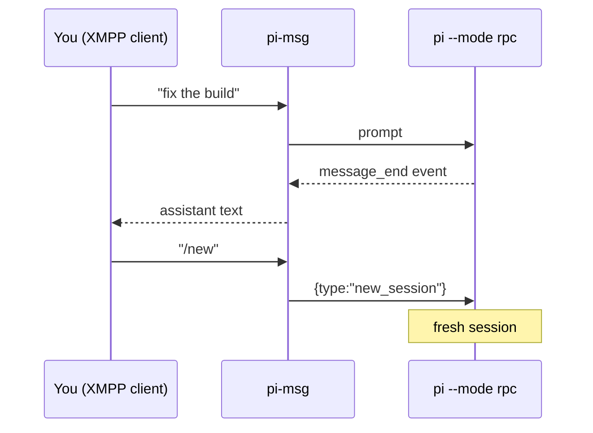

# pi-msg

Drive the [Pi](https://pi.dev) coding agent **entirely from an XMPP chat client** —
1:1 or in a group chat (MUC).

`pi-msg` launches `pi --mode rpc`, then bridges Pi's JSONL event stream to XMPP
(via [mellium.im/xmpp](https://mellium.im/xmpp)): the assistant's replies are relayed
to you as chat messages, and your chat messages drive the agent — plain prompts **and**
slash commands, exactly as if you'd typed them into Pi locally.

Because it runs Pi in RPC mode, commands like `/new` work over chat (an earlier
in-process-extension version couldn't do this — `sendUserMessage` can't invoke Pi's
command layer).

## How it works



- Each finished **assistant message** → sent to you as chat.
- Agent state shows on three independent signals (1:1): a **typing indicator** while a
  reply is actually being written, presence **`<show>`** (`dnd` while busy, available
  when idle), and a presence **status** label of the current activity (`thinking…`,
  `running: <cmd>`, `replying…`, `retrying…`, `listening`). When a run settles with
  **no** text you get a `✅ done (no reply) — your turn` nudge.
- Messages you send are acknowledged with **read receipts** — XEP-0184 delivery
  receipts and XEP-0333 chat markers (`displayed`) — when the agent takes them in, if
  your client requests them.
- Your chat messages → routed to Pi:

| You send | Becomes |
| --- | --- |
| plain text | a prompt to the agent |
| `/skill:name …`, `/template …`, any extension command | a prompt (Pi expands/runs it) |
| `/new` | `new_session` (fresh session; connection stays up) |
| `/compact [instructions]` | `compact` |
| `/model <provider/id>` or `/model <search>` | `set_model` |
| `/think <off\|low\|medium\|high\|…>` | `set_thinking_level` |
| `/abort` (or `/stop`) | `abort` |
| `/dump` (or `/dump pretty`) | send the session transcript to the owner — raw JSONL, or `pretty` for indented per-record JSON (no LLM turn) |
| `/quit` (or `/exit`) | shut down the bridge and Pi |

## Configuration

Create `~/.config/pi-msg/config.json` (override the path with `PI_MSG_CONFIG`), then
`chmod 600` it:

```json
{
  "accounts": {
    "default": {
      "jid": "pi@chat.example.com",
      "password": "super-secret",
      "owner": "you@chat.example.com",
      "model": "anthropic/claude-sonnet-latest",
      "workdir": "/path/to/your/project"
    }
  }
}
```

Per-account fields:

| field | required | default | notes |
| --- | --- | --- | --- |
| `jid` | yes | — | bare JID of the bot account |
| `password` | yes | — | bot account password |
| `owner` | yes | — | the human this account relays to; the **canonical** (trusted) driver |
| `service` | no | `<jid-domain>:5222` | `host:port` (a leading `xmpp://` is tolerated) |
| `resource` | no | `pi-msg` | XMPP resource (client-session label) |
| `model` | no | Pi's default | model pattern passed to `pi --model` |
| `workdir` | no | current dir | working directory for the agent (also where Pi discovers `AGENTS.md`/`CLAUDE.md`) |
| `room` | no | — | a bare MUC JID (or an **array** of them) to also join for **group chat** (see below) |
| `nick` | no | JID localpart | occupant nickname used in the room(s) |
| `roomTrigger` | no | `nick` | address prefix that makes a room message a prompt (e.g. `pi` → `pi: …`) |
| `uploadService` | no | auto-probed | XEP-0363 upload component JID for file transfer (e.g. `upload.chat.example.com`) |
| `pingInterval` | no | `60s` | keepalive cadence (Go duration): XEP-0199 server ping + XEP-0410 MUC self-ping; `0` disables |
| `reactions` | no | `false` | XEP-0444 emoji reactions on 1:1 owner messages: lifecycle → 👀 picked up / ✅ done / ⛔ aborted, and enables the agent-driven `send_reaction` tool (see [Agent tools](#agent-tools)) |
| `avatar` | no | — | path to a local image (PNG/JPEG/GIF) published as the bot's XEP-0153 vCard profile picture on connect |
| `omemo` | no | `false` | end-to-end encrypt 1:1 messages with the owner via OMEMO (XEP-0384 v0.3); see [OMEMO encryption](#omemo-encryption) |

Multiple accounts: add more keys under `accounts`; `default` is used unless you set
`PI_MSG_ACCOUNT=<name>`. In 1:1 mode only the `owner` JID may drive the agent.

## OMEMO encryption

Set `"omemo": true` on an account to end-to-end encrypt the 1:1 conversation
with the owner using **legacy OMEMO** (XEP-0384 v0.3, the
`eu.siacs.conversations.axolotl` namespace that Conversations and Converse
interoperate on). On connect the bot generates a device identity, publishes its
bundle and device id to PEP, encrypts each reply to **every** device the owner
has published (phone, laptop, …), and decrypts incoming encrypted messages.

- **Scope (v1):** 1:1 with the owner only. Group chat and encrypted file
  transfer (`aesgcm://`) are **not** covered — those stay plaintext.
- **Trust:** blind-trust-before-verification (BTBV) — a new owner device is
  trusted automatically; a *changed* key on a known device is rejected. The
  device fingerprint is logged on startup for out-of-band verification.
- **Opportunistic:** if the owner hasn't published any OMEMO device yet (or a
  bundle can't be fetched), the bot logs a loud warning and sends **plaintext**
  so messaging still works during setup. Once the owner's client advertises
  OMEMO, replies encrypt automatically.
- **Keys** persist under `$XDG_STATE_HOME/pi-msg/omemo/<account>` (override the
  base with `PI_MSG_STATE_DIR`). They must survive restarts — deleting them
  makes every peer see an untrusted new device.
- **Switching clients** is supported (OMEMO is multi-device), but a newly added
  client can't read messages sent before it existed — OMEMO has no shared
  history. The bot always fans out to all of the owner's current devices.

Built on [`go.mau.fi/libsignal`](https://pkg.go.dev/go.mau.fi/libsignal) for the
Signal double-ratchet; the XEP-0384 stanza/PEP layer is in this repo
(`omemo_wire.go`, `omemo_pep.go`, `internal/omemo/`).

## Group chat (MUC)

Set `room` on an account (a single MUC JID, or an array of them) and pi-msg
**also** joins each. **The owner's 1:1 stays the primary channel** — joining a
room is purely additive and doesn't change 1:1 behaviour (typing indicator,
lifecycle notices, and unsolicited output all still go to the owner). Each reply
goes back to whichever channel the message arrived on, including the specific
room when several are joined. Room messages are handled on **two independent
axes**:

- **Trigger** — does the message start/steer a turn?
  - the **owner** → always
  - anyone else who **addresses the bot by name** (`pi: …` / `pi, …`) → always
  - all other chatter → never (it's buffered as ambient context)
- **Authority** — is the content trusted?
  - the **owner** → canonical (authoritative)
  - everyone else, even when addressing the bot → untrusted *commentary*; the agent is
    told to use its judgment and is under no obligation to act on it

Untriggered messages are buffered and, on the next turn, prepended to the prompt as a
clearly-labeled *"room commentary — non-canonical"* block, then the buffer clears.

**Reply routing (explicit `from:`/`to:`).** When an account has room access, routing is
fully explicit — no guessing. Each prompt the agent receives leads with a header naming
the message's origin:

```
from: <channel jid>     # the room (group msg) or the owner (DM) — reply here to answer in place
sender: <person jid>    # room messages only, when the real JID is known — reply here to DM them
<message body>
```

And **every** agent reply must begin with a `to: <jid>` line naming its destination:

- `to: <room jid>` → the group chat (groupchat)
- `to: <owner or occupant jid>` → that person, 1:1

One reply may contain **several `to:` blocks** — each `to:` line starts a new message, so
the agent can fan a single turn out to multiple destinations:

```
to: team@muc.chat.zachmanson.com
Deploying now — back in 5.
to: zach@chat.zachmanson.com
(privately: the staging creds are stale, heads up)
```

Destinations are **allowlisted**: the owner, joined room(s), and real JIDs currently seen
in a room. A reply whose `to:` is missing or points anywhere else is sent to the owner, so
nothing is silently lost — the agent can't message arbitrary users. In a pure 1:1 account
(no room) there are no prefixes; replies just go to the owner.

**File transfer.** The agent sends files with the **`send_file`** tool (a structured tool
call, not in-band text — see [Agent tools](#agent-tools) below): pi-msg uploads the file via
**XEP-0363 HTTP Upload** and sends the resulting URL as an **XEP-0066** out-of-band message,
so the recipient's client shows a downloadable file. The destination is allowlisted (owner,
joined rooms, known occupants) exactly like a `to:` reply. The upload component is discovered
automatically (`upload.<domain>` / `httpupload.<domain>`) or set explicitly via the
`uploadService` config field.

**The room must be non-anonymous** (ejabberd: *"Present real Jabber IDs to → anyone"*,
optionally *members-only*). The owner is recognized by real JID; in a semi-anonymous
room real JIDs are hidden, so the owner can't be distinguished and every message falls
through to the untrusted/ambient tiers.

## Agent tools

Beyond reply text, the agent gets structured **tools** (registered by a small companion
extension that pi-msg loads into `pi --mode rpc`, which relays each call back to pi-msg to
perform the XMPP action):

| Tool | What it does | Enabled when |
| --- | --- | --- |
| `send_reaction` | React to the human's latest message with an emoji (XEP-0444) | `reactions` is on |
| `send_file` | Upload a local file and deliver it (XEP-0363 + XEP-0066); dest defaults to the current conversation, allowlisted | always |

Reply **routing** (`to:`) stays an in-band text convention (above); only these discrete
side-effect actions are tools.

## Run

```bash
go build -o pi-msg . && ./pi-msg     # from the repo
```

### Nix

```bash
nix run   github:zachpmanson/pi-msg    # run the bridge
nix build github:zachpmanson/pi-msg    # build the package (bin: pi-msg)
```

Dev shell (Go + gopls) via `nix develop`, or automatically with
[direnv](https://direnv.net/) — the repo ships a `.envrc` (`use flake`); run
`direnv allow` once.

Set `PI_MSG_DEBUG=1` to print connection/status/stderr diagnostics. On startup the bot
simply comes **online** in your roster (presence `listening`); on shutdown or a pi crash it
goes **offline** with a `<status>` describing why and when — pi-msg no longer posts chat
banners for these lifecycle events.

Requirements: Go ≥ 1.26 (to build), and a `pi` on `PATH` that's logged into a provider
(`pi` → `/login`).

## Notes

- Pi runs tools autonomously (no built-in approval prompts). If some other extension
  raises a dialog (`select`/`confirm`/`input`/`editor`), pi-msg auto-dismisses it
  (nobody's at the TUI) and tells you over chat — so approval-gated tools are declined
  over the bridge.
- Auth uses SASL SCRAM-SHA-256 (mellium negotiates it cleanly against ejabberd);
  STARTTLS is required first.
