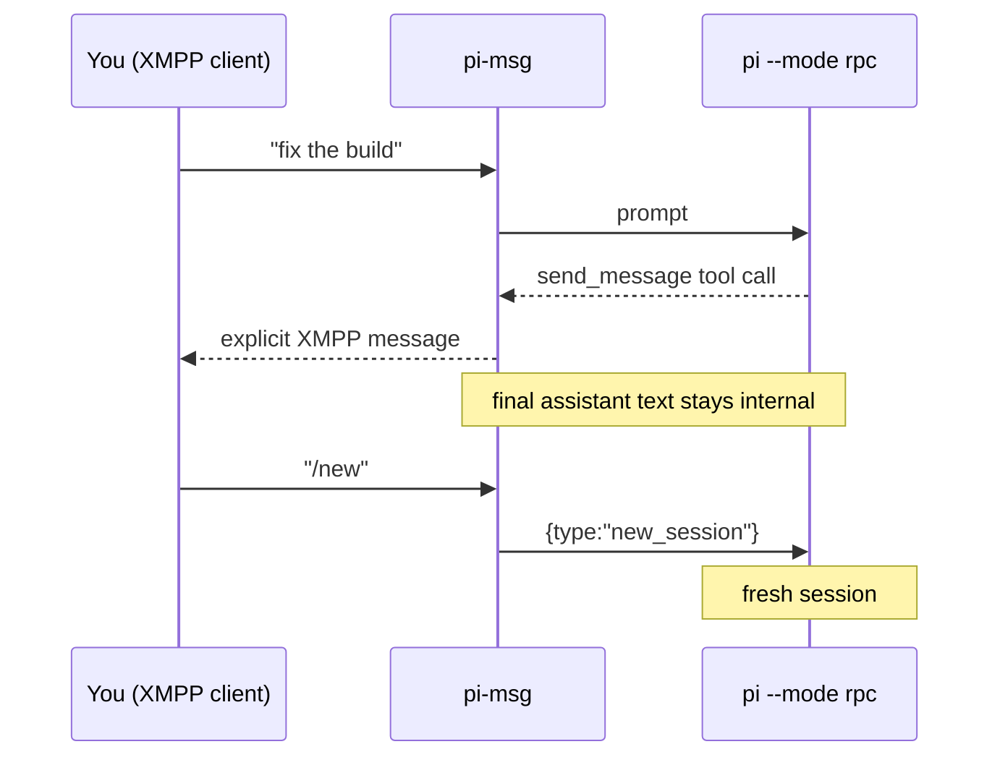

# pi-msg

Drive the [Pi](https://pi.dev) coding agent entirely over XMPP.

`pi-msg` launches `pi --mode rpc`, then bridges Pi's JSONL event stream to XMPP, with command interception for system commands like `/new`.


## Comms


```mermaid
sequenceDiagram
    participant You as You (XMPP client)
    participant Bridge as pi-msg
    participant Pi as pi --mode rpc
    You->>Bridge: "fix the build"
    Bridge->>Pi: prompt
    Pi-->>Bridge: send_message tool call
    Bridge-->>You: explicit XMPP message
    Note over Pi,Bridge: final assistant text stays internal
    You->>Bridge: "/new"
    Bridge->>Pi: {type:"new_session"}
    Note over Pi: fresh session
```

## Supported features

- Sessions resuming across restarts, `/new` to reset
- Pi slash commands work over chat
- XMPP DMs and group chats
- Explicit outbound messages via `send_message`; final assistant text is internal
- Threaded replies via `reply_to`
- Room and 1:1 history via `read_messages`
- MAM supported
- File transfer (XEP-0363/0066)
- Reactions (XEP-0444)
- Presence updates
- Read receipts

## Commands

Your chat messages → routed to Pi:

| You send | Becomes |
| --- | --- |
| plain text | a prompt to the agent |
| `/skill:name …`, `/template …`, any extension command | a prompt (Pi expands/runs it) |
| `/new` | `new_session` (fresh session; connection stays up) |
| `/compact [instructions]` | `compact` |
| `/model <provider/id>` or `/model <search>` | `set_model` |
| `/models` | list available models with the current one marked (no LLM turn) |
| `/session` | session stats — id, file, message counts, tokens, cost (no LLM turn) |
| `/name [name]` | show the session display name, or set it |
| `/think <off\|low\|medium\|high\|…>` | `set_thinking_level` |
| `/abort` (or `/stop`) | `clear_queue`, then `abort` — stops the run AND flushes pi's queued messages: a steer that landed mid-run can't start a fresh run the instant the aborted one stops. The reply names how many queued messages it dropped. |
| `!` | `abort` only — the quick interrupt. Stops whatever is currently running (a command or thinking) but leaves queued messages intact, so the next one is evaluated right after. |
| `/dump` (or `/dump pretty`) | send the session transcript to the owner — raw JSONL, or `pretty` for indented per-record JSON (no LLM turn) |
| `/export` | render the current session to HTML via pi's `export_html` RPC and **send it as a file over XMPP** (XEP-0363 HTTP Upload) — **deterministic**, no agent turn; the rendered session lands as an inline, downloadable file |
| `/quit` (or `/exit`) | shut down the bridge and Pi |

`!` can also be used as command prefix — `/new` and `!new` are
interchangeable.

## Configuration

Create `~/.config/pi-msg/config.json` (override the path with `PI_MSG_CONFIG`), then
`chmod 600` it:

```json
{
  "accounts": {
    "default": {
      "jid": "pi@chat.example.com",
      "password": "super-secret",
      "owner": "you@chat.example.com",
      "model": "anthropic/claude-sonnet-latest",
      "workdir": "/path/to/your/project"
    }
  }
}
```

Per-account fields:

| field | required | default | notes |
| --- | --- | --- | --- |
| `jid` | yes | — | bare JID of the bot account |
| `password` | yes | — | bot account password |
| `owner` | yes | — | the human this account relays to; the **canonical** (trusted) driver |
| `service` | no | `<jid-domain>:5222` | `host:port` (a leading `xmpp://` is tolerated) |
| `resource` | no | `pi-msg` | XMPP resource (client-session label) |
| `model` | no | Pi's default | model pattern passed to `pi --model` |
| `workdir` | no | current dir | working directory for the agent (also where Pi discovers `AGENTS.md`/`CLAUDE.md`) |
| `rooms` | no | `[]` | group-chat rooms: objects with `jid`, `role`, `trigger`, and `reactions`; legacy `room` and `errorRoom` fields are rejected |
| `nick` | no | JID localpart | occupant nickname used in the room(s) |
| `roomTrigger` | no | `nick` | account-wide address prefix that makes a room message a prompt (e.g. `pi` → `pi: …`); override per room |
| `uploadService` | no | auto-probed | XEP-0363 upload component JID for file transfer (e.g. `upload.chat.example.com`) |
| `pingInterval` | no | `60s` | keepalive cadence (Go duration): XEP-0199 server ping + XEP-0410 MUC self-ping; `0` disables |
| `reactions` | no | `false` | XEP-0444 reactions and lifecycle acknowledgements; override per room |
| `allowArbitraryJid` | no | `false` | Allow `send_message` and `read_messages` to target valid peer JIDs outside the owner/configured-room default allowlist; configured rooms must still be configured |
| `resetSessionOnAway` | no | `false` | Start a fresh Pi session when the account becomes idle/away; prior session files are retained |
| `beforeAgentStartText` | no | — | literal text added to the system prompt before every turn; empty or whitespace means unset |
| `avatar` | no | — | path to a local image (PNG/JPEG/GIF) published as the bot's XEP-0153 vCard profile picture on connect |
| `creditWatch` | no | — | low-credit protection with a `minBelowUsd` floor. Reports the remaining OpenRouter balance after every `/new`, and a proactive watcher probes the balance hourly and DMs the owner when it drops below the floor (re-warns at most every 6h while still below). A model run that dies on an OpenRouter out-of-credits error (HTTP 402) is also reported to the owner directly instead of the generic 🫡 unanswered-run reaction. e.g. `{ "creditWatch": { "minBelowUsd": 2 } }`. Only active when pi's auth file (`<config-dir>/auth.json`) holds an `openrouter` api key; otherwise it's skipped |
| `mam` | no | `true` | MAM support; set `false` to disable archive backfill |

Multiple accounts: add more keys under `accounts`; `default` is used unless you set
`PI_MSG_ACCOUNT=<name>`. In 1:1 mode only the `owner` JID may drive the agent. Outbound chat is sent only by `send_message`; see [Messaging and Room Addressing](docs/routing.md).

## Project layout

- `cmd/pi-msg/` — executable entry point
- `internal/pimsg/` — bridge implementation and tests
- `internal/pimsg/piext/` — embedded Pi extension source
- `docs/`, `scripts/` — project documentation and tooling

## Building

```bash
make build
```

This is packaged for Nix.

```bash
nix run   github:zachpmanson/pi-msg    # run the bridge
nix build github:zachpmanson/pi-msg    # build the package (bin: pi-msg)
```

Dev shell (Go + gopls) via `nix develop`, or automatically with
[direnv](https://direnv.net/) — the repo ships a `.envrc` (`use flake`); run
`direnv allow` once.

### On-demand spawns: `--prompt`

`pi-msg --prompt "<task>"` (alias `--command`) spawns a **fresh, on-demand
persona**. It intentionally does **not** resume the saved session
(stateless by construction) or pick up any missed messages.

The same payload can ride the existing one-shot start-directive file
(`<config-dir>/<account>.start`, written via `writePromptDirective`):

```
prompt
resolve zachpmanson/pi-msg#35 and open a PR
```

Either way the directive file is consumed (one-shot); an explicit `--prompt`
flag overrides a file-delivered payload. Routine restarts that carry no prompt
keep the existing resume + proactive/idle behavior unchanged.
